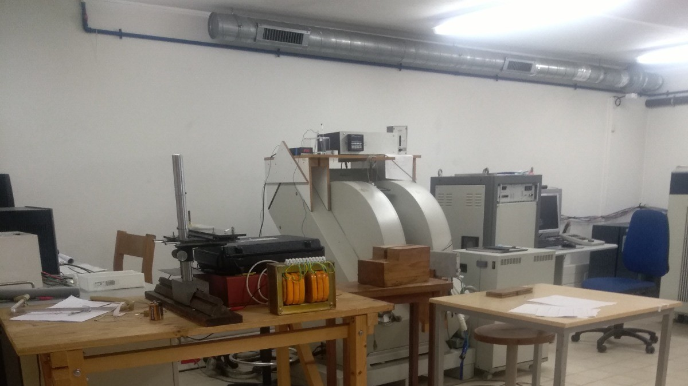
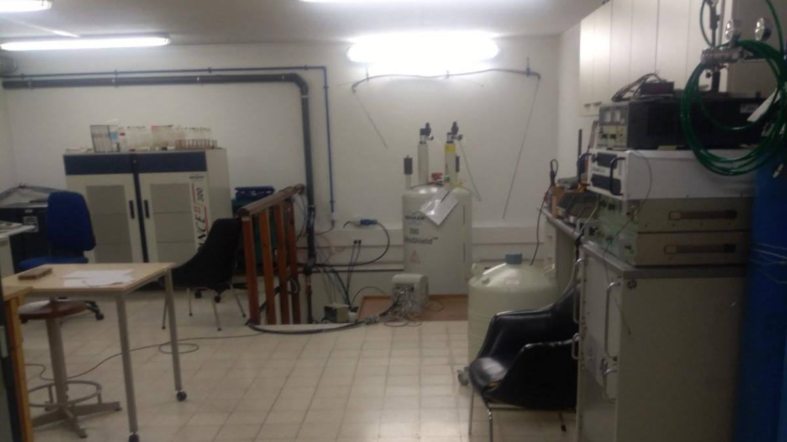

<div align="center">


# NMR Study of 5CB Liquid Crystal Phase Transition

<h3>"Estudo da transição de fase isotrópica para fase nemática do 5CB"</h3>

<p align="center">
  <b>Armando Gonçalves</b> • <b>João Silva</b> • <b>Rodrigo Ferreira</b> • <b>Pedro Teigão</b>
</p>

</div>

---

<p align="center">
  
  
  <br>
  <i>Figure 1: NMR Spectrometer setup at CeFEMA laboratories.</i>
</p>

## 📋 Table of Contents

- [Overview](#overview)
- [Theoretical Background](#theoretical-background)
- [Experimental Setup](#experimental-setup)
- [Key Results](#key-results)
- [Conclusions](#conclusions)

---

## 🔬 Overview

This work investigates the **nematic-isotropic phase transition** of 5CB (4-cyano-4'-pentylbiphenyl), a thermotropic liquid crystal, using **¹H Nuclear Magnetic Resonance (NMR) spectroscopy**. 

This project was developed during a research internship at the **Complex Fluid, NMR and Surfaces Group (CFNMRS)** within **CeFEMA** (Center of Physics and Engineering of Advanced Materials). The study focuses on analyzing spectral data to determine key physical properties such as the transition temperature and the order parameter of the liquid crystal.

### Objectives
- Observe the phase transition from nematic to isotropic phase
- Determine the critical transition temperature (T_c)
- Characterize molecular ordering through the order parameter (S)
- Analyze spin-lattice relaxation time (T₁) behavior across the transition

### Key Findings
- **Critical temperature:** T_c = 34.085°C (literature: ~35°C)
- **Order parameter:** Successfully modeled using Haller's empirical equation
- **T₁ relaxation:** Consistent with BPP (Bloembergen-Purcell-Pound) model
- Clear distinction between nematic and isotropic phases via NMR spectra

---

## 📚 Theoretical Background

### Liquid Crystals
5CB is a **nematic liquid crystal** that exhibits:
- Liquid-like fluidity with partial crystalline ordering
- Temperature-dependent phase transitions
- Anisotropic optical and magnetic properties

### Phase Transition
The **nematic → isotropic transition** occurs at ~35°C:
- **Nematic phase (T < T_c):** Molecules align along a preferred direction (director)
- **Isotropic phase (T > T_c):** Random molecular orientation
- **Order parameter S:** Quantifies the degree of molecular alignment
  ```
  S = (3⟨cos²θ⟩ - 1)/2
  ```
  where θ is the angle between molecular director and average orientation

### NMR Spectroscopy
Two key observable phenomena:

1. **Dipolar Splitting (Nematic Phase)**
   - Intermolecular dipole-dipole interactions create broad doublets
   - Splitting magnitude (Δν) is proportional to order parameter S
   - Haller equation: `S = (1 - T/T*)^γ`

2. **Chemical Shift (Isotropic Phase)**
   - Intramolecular electron shielding effects
   - Sharp peaks corresponding to benzene rings and alkyl chains
   - No dipolar coupling due to random orientation averaging

3. **Spin-Lattice Relaxation (T₁)**
   - Recovery of longitudinal magnetization: `M_z(t) = M_z,0(1 - 2e^(-t/T₁))`
   - Dominated by molecular rotations at 300 MHz (BPP model)
   - Shows discontinuity at phase transition

---

## 🔧 Experimental Setup

### Equipment
- **NMR Spectrometer:** 300.13 MHz (¹H Larmor frequency)
- **Magnet:** Superconducting magnet with shim system
- **Temperature control:** Heating system with thermocouple calibration
- **RF system:** Transmitter/receiver with pre-amplifier
- **Software:** Fourier Transform processing and spectrum analysis

### Sample Preparation
- **Compound:** 5CB (4-cyano-4'-pentylbiphenyl, C₁₈H₁₉N)
- **Temperature range:** 30-36°C (covering nematic and isotropic phases)
- **Equilibration time:** ~6-8 minutes per temperature point

### Pulse Sequence
- **180° pulse:** 18 μs (spin inversion)
- **Delay:** 3.5 s (optimized for signal acquisition)
- **90° pulse:** 9 μs (detection)
- **Power:** 50 W

### Calibration
Temperature calibration performed using paraffin reference:
```
T_real = (1.095 ± 0.018) × T_console - (1.31 ± 0.55)°C
```

---

## 📊 Key Results

### 1. Order Parameter Analysis

**Dipolar splitting fits (Haller model):**

| Parameter | Δν₁ | Δν₂ |
|-----------|-----|-----|
| Δν₀ (Hz) | 34004 ± 32 | 22504 ± 164 |
| T* (°C) | 34.185 ± 0.02 | 34.185 ± 0.007 |
| γ | 0.1431 ± 0.0008 | 0.165 ± 0.001 |

**Derived critical temperature:**
- T* = 34.185°C → **T_c = 34.085°C**
- Deviation from literature (35°C): 0.915°C

**Order parameter behavior:**
- S decreases continuously as T approaches T_c in nematic phase
- First-order transition with discontinuity at T_c
- γ values consistent with literature (0.15-0.16)

### 2. Chemical Shift (Isotropic Phase)

Identified peaks corresponding to molecular structure:

| Peak | δ (ppm) | Assignment |
|------|---------|------------|
| δ₁ | ~7.4 | Benzene ring protons |
| δ₂ | ~2.5 | CH₂ adjacent to benzene |
| δ₃ | ~1.3 | Alkyl chain CH₂ |
| δ₄ | ~0.9 | Terminal CH₃ |

Centroids remain constant across isotropic phase temperatures.

### 3. T₁ Relaxation Analysis

**BPP Model fit parameters:**

| Parameter | Value |
|-----------|-------|
| S₀ | (8.957 ± 1.048) × 10⁻² |
| δ_p | (9.528 ± 3.410) × 10⁻¹² |
| E_a | 563.143 ± 1.414 J/mol |
| ω | (2.677 ± 0.001) × 10⁵ rad/s |

**Key observations:**
- T₁ increases with temperature in both phases (increased molecular freedom)
- Sharp decrease at phase transition (~307.1-307.3 K)
- BPP model successfully describes experimental data
- Rotational motion dominates relaxation at 300 MHz

### 4. Heating vs Cooling Effects

Systematic T₁ differences observed near T_c:
- **Heating:** Higher T₁ values (thermal gradient → lower actual temperature)
- **Cooling:** Lower T₁ values (thermal gradient → higher actual temperature)
- Effect negligible for |T - T_c| > 1°C
- Mitigation: Longer equilibration times near transition

---

## 🎯 Conclusions

### Main Achievements
1. ✅ Successfully identified nematic-isotropic phase transition at **34.085°C**
2. ✅ Quantified molecular order using dipolar splitting (Haller model)
3. ✅ Characterized T₁ relaxation behavior across transition (BPP model)
4. ✅ Clearly distinguished phases via NMR spectral features

### Limitations & Future Work

**Identified limitations:**
- Single measurement per temperature (limited statistical significance)
- Thermal gradient effects near T_c
- Uncertainty in tuning, pulse power, and sequence optimization
- Limited exploration of parameter space

**Suggested improvements:**
1. **Multiple trials per temperature** for proper statistical analysis
2. **Longer equilibration times** near phase transition (15+ minutes)
3. **Study of heating/cooling rate effects** on transition sharpness
4. **Quantitative analysis** of peak area ratios (nematic vs isotropic contributions)
5. **Sample container effects** on spectra (surface interactions)
6. **Variable frequency studies** to validate relaxation mechanisms

### Broader Context
- Demonstrates NMR as powerful tool for studying liquid crystal dynamics
- Haller and BPP models adequately describe experimental observations
- Results consistent with literature despite experimental constraints
- Provides foundation for more advanced liquid crystal studies

---

**Last updated:** January 2026
